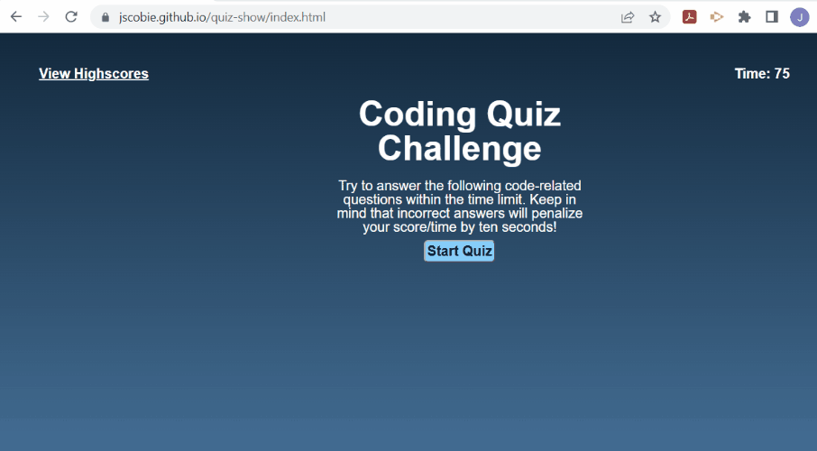

# Challenge 04 Web-APIs: Code Quiz

## Description

This project was built to showcase my ability to supply a working Quiz on coding topics to impress that I have learned the various steps of CSS, HTML, JavaScript, and Web-API's and can use them to make a website. This project tests simple HTML and CSS knowledge but is heavily showcasing JavaScript and Web-API coding to handle a quiz with high scores.

When a user arrives, they click a start button and they will begin a timed test. When they answer one question they will be prompted to another until all questions are completed or time runs out. If the user answers incorrectly time is subtracted from the clock. The game ends when the timer reaches 0 or user has exhausted all questions. Once the game ends the user can save their initials and score. The highscores are stored on another page and can be cleared by the user through clicking a button.

## Mock-Up

Github Repository Link: https://github.com/jscobie/quiz-show

Deployed page Link: https://jscobie.github.io/quiz-show/

The following animation demonstrates the application functionality:

## Installation

Required items are index.html, highscores.html, script.js, script-scores.js, reset.css and style.css files (all to be located in assets folder).

## Usage

The usage of this project is to allow myself to turn this project in for grading to the MSU Bootcamp academic grading team.

## Credits

Credit to the MSU Bootcamp and instructors for training and training materials to resolve some of these issues. 
